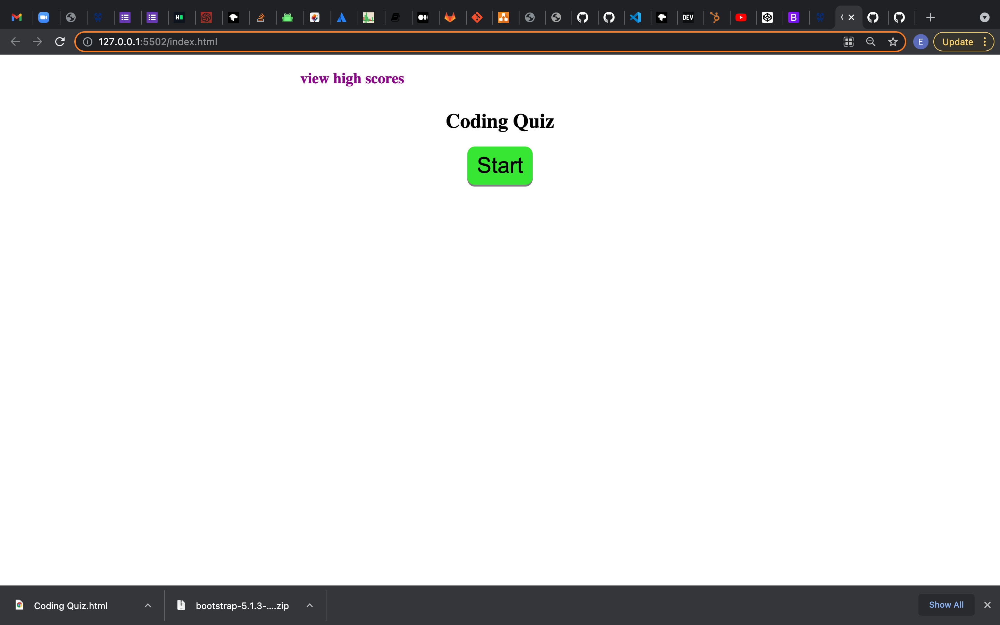
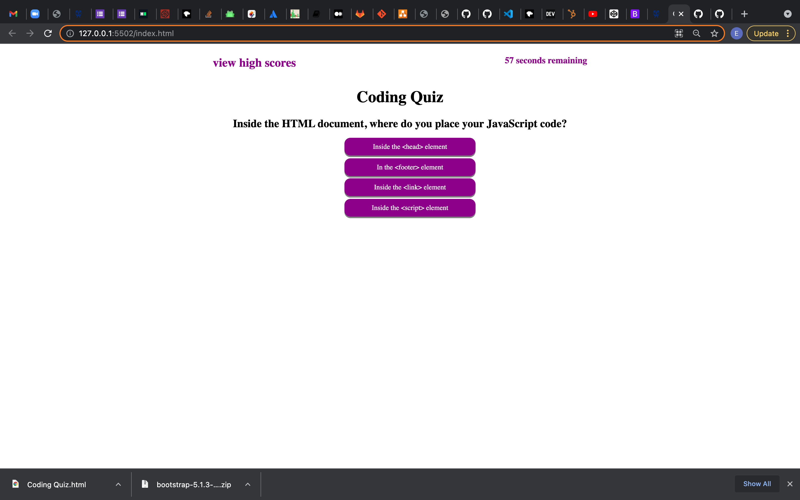

# CodingQuiz-chall04

## Purpose

To test your knowlegde of code that you've learned so far

## Built With

HTML
CSS
JAVASCRIPT

## Acceptance Criteria

GIVEN I am taking a code quiz
WHEN I click the start button
THEN a timer starts and I am presented with a question
WHEN I answer a question
THEN I am presented with another question
WHEN I answer a question incorrectly
THEN time is subtracted from the clock
WHEN all questions are answered or the timer reaches 0
THEN the game is over
WHEN the game is over
THEN I can save my initials and score

## Preview Of Page

## Website
https://elip2389.github.io/CodingQuiz-chall04/

## Sites Used For Reference
https://www.w3schools.com/html/html_intro.asp
https://developer.mozilla.org/en-US/